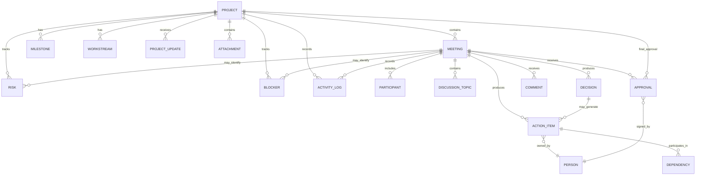
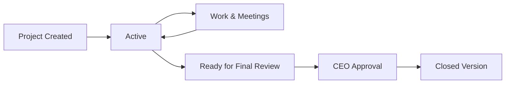
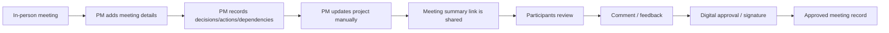
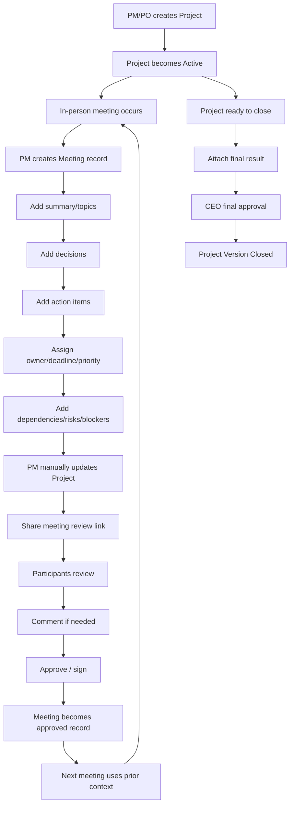

# Project Governance & Meeting Accountability System
## Information Architecture, Product Model, Content Model, and Core Flows

> **Document purpose:** Establish a reliable product foundation before UI design or implementation.  
> This document separates **confirmed requirements** from **design recommendations** and **open questions** so assumptions are not mistaken for product decisions.

---

## 1. Executive Summary

The product is an internal **Project Governance & Meeting Accountability System**.

Its primary purpose is to ensure that decisions, responsibilities, dependencies, and project changes do not disappear between meetings. It gives PMs and POs one structured place to:

- create and manage projects;
- document every project meeting;
- record discussions, decisions, action items, owners, deadlines, priorities, and dependencies;
- manually update project-level status, risks, blockers, milestones, and progress;
- send a meeting summary to meeting participants for review, comment, digital approval, and signature;
- preserve a chronological, auditable history of project changes and meeting outcomes;
- close a project version after final CEO approval and attach the final outcome/documentation.

The product is **not primarily a task manager, chat product, or meeting-hosting tool**.  
Its core is the traceable relationship between:

```text
Project
→ Meeting
→ Decision
→ Action
→ Owner
→ Dependency
→ Progress / Project State
→ Review & Signature
→ Historical Evidence
```

The intended result is a trustworthy project record that answers both:

1. **Where is the project now?**
2. **How did the project reach this state?**

---

## 2. Requirement Confidence Legend

| Label | Meaning |
|---|---|
| **Confirmed** | Explicitly stated by the Head of Design / project context |
| **Recommended** | Product-design recommendation derived from confirmed needs |
| **Open Question** | Not enough source data yet; must not be silently decided |
| **Future** | Explicitly mentioned as later scope / integration |

---

## 3. Product Definition

### 3.1 Product category
**Confirmed**

A project dashboard for viewing project status, with structured meeting documentation and the ability to produce/share meeting documentation.

### 3.2 Working product definition
**Recommended wording**

> A governance-focused project workspace where PMs and POs maintain project health and document every meeting as an approved, traceable record of decisions, actions, ownership, dependencies, and changes.

### 3.3 Core problem
**Confirmed**

After meetings, the team lacks a reliable shared record of:

- what was finally decided;
- who is responsible for each action;
- what each person must complete before the next meeting;
- who is waiting on whom;
- what dependencies exist between tasks or people;
- how project status changed as a result of the meeting.

### 3.4 Core value proposition
**Recommended**

> Nothing agreed in a project meeting should be lost between meetings. Every decision, commitment, dependency, approval, and project change remains visible, attributable, and historically traceable.

---

## 4. Product Goals

### 4.1 Primary goals
**Confirmed / strongly supported**

1. Create a single source of truth for project state.
2. Create a structured record for every project meeting.
3. Convert meeting outcomes into explicit decisions and action items.
4. Make accountability visible through owners, deadlines, priorities, and dependencies.
5. Preserve approval/signature evidence from meeting participants.
6. Preserve a complete history of project changes.
7. Make project status and progress understandable at a glance.
8. Close each project version with final CEO approval.

### 4.2 Secondary goals
**Recommended**

- Reduce repeated discussions caused by missing context.
- Reduce ambiguity around ownership.
- Improve continuity from one meeting to the next.
- Make project reviews easier for leadership.
- Make retrospective investigation possible: “Why did this change?” / “Who approved this?” / “Which meeting created this action?”

### 4.3 Non-goals for the current foundation

- Real-time chat or team communication.
- Running video/audio meetings inside the product.
- Notifications to action owners.
- Full team task-management workspace.
- Automatic project updates from action items.
- Automatic meeting transcription in MVP.
- Replacing Jira / Linear / Asana as an execution system.

---

## 5. Users and Actors

### 5.1 Primary users

#### PM — Project Manager
**Confirmed**

The PM is a principal operator and maintainer of project information.

Primary responsibilities:

- create projects;
- add meeting records after meetings;
- update meeting summaries;
- add decisions;
- add action items;
- assign owners;
- define deadlines, priorities, related decisions, and dependencies;
- manually update project-level information;
- share meeting summaries for review/signature;
- preserve/update project status and history.

#### PO — Product Owner
**Confirmed**

The PO is also an internal operator.

Current evidence indicates the PM and PO control project updates and records, but the exact permission difference between PM and PO is not yet defined.

**Open Question:** Are PM and PO permissions identical?

### 5.2 Secondary actors

#### Team Lead / Meeting Participant
**Confirmed**

Team Leads are not primary dashboard operators.

After a meeting:

- they receive a link to the meeting summary;
- they review the result;
- they digitally sign / approve it;
- they may submit a comment or feedback note.

**Recommended actor model:** `Reviewer / Signatory`

This role should have a deliberately lightweight experience compared with PM/PO.

#### CEO / Final Approver
**Confirmed**

At the end of a project version:

- the final project result/documentation is prepared;
- CEO approval/signature is required;
- the project version is then closed.

**Recommended actor model:** `Final Approver`

### 5.3 Future system actor

#### Meeting Assistant
**Future**

An existing meeting assistant can record meeting audio and create a summary.

Future integration may connect this output to the governance product.

```text
Meeting Capture
→ AI / Assistant Summary
→ Human Review
→ Structured Project Record
```

Human validation should remain explicit because the project record is approval-sensitive.

---

## 6. Permission Model

| Capability | PM | PO | Team Lead / Participant | CEO |
|---|---:|---:|---:|---:|
| View project dashboard | Yes | Yes | Not required for MVP | Review context as needed |
| Create project | Yes | Yes* | No | No |
| Edit project | Yes | Yes* | No | No |
| Create meeting | Yes | Yes* | No | No |
| Edit meeting draft | Yes | Yes* | No | No |
| Add decision/action/dependency | Yes | Yes* | No | No |
| Update project health/progress | Yes | Yes* | No | No |
| Review meeting summary | Yes | Yes | Yes | Optional |
| Comment on meeting summary | Yes | Yes | Yes | Optional |
| Sign/approve meeting summary | Not primary purpose | Not primary purpose | Yes | Optional |
| Final project approval | No | No | No | Yes |
| Close project version | After approval | After approval* | No | Approval trigger |
| View audit/history | Yes | Yes | Meeting-scoped if exposed | Final-review scope |

`*` = exact PM/PO distinction is an open product decision.

---

## 7. Core Domain Model

| Entity | Purpose | Confidence |
|---|---|---|
| **Project** | Primary container and unit of governance | Confirmed |
| **Project Version** | Distinguishes independent versions such as “Leili V1” and “Leili V2” | Confirmed concept; modeling approach recommended |
| **Meeting** | Chronological project event and source of decisions/actions | Confirmed |
| **Participant** | Person present in a meeting / potential signatory | Confirmed |
| **Discussion Topic** | Structured topic discussed in a meeting | Confirmed by accepted content structure |
| **Decision** | Explicit agreed outcome from a meeting | Confirmed |
| **Action Item** | Follow-up commitment resulting from a meeting/decision | Confirmed |
| **Dependency** | Blocking/waiting relationship between actions or work | Confirmed |
| **Risk** | Potential threat to project outcome | Confirmed from dashboard document |
| **Blocker** | Current impediment preventing progress | Confirmed |
| **Milestone** | Significant project checkpoint | Confirmed |
| **Workstream / Block** | Major stream/block of project work | Confirmed |
| **Project Update** | Manual structured update to project state | Recommended abstraction |
| **Approval / Signature** | Participant or CEO confirmation | Confirmed |
| **Comment / Feedback** | Reviewer feedback attached to meeting review | Confirmed |
| **Attachment** | Final docs, links, outputs, supporting material | Confirmed / dashboard-supported |
| **Activity / Change Log** | Historical record of changes | Confirmed |
| **User / Person** | Actor or owner identity | Confirmed |

---

## 8. Entity Relationship Model



---

## 9. Entity Field Model

### 9.1 Project

**Confirmed fields from project documentation / answers**

- Project name
- PM
- PO
- Overall status
- Priority
- Start date
- Target deadline
- Delivery date
- Current phase
- Completion %
- Current status summary
- Current focus
- Next milestone
- Scope health
- Timeline health
- Resources health
- Quality health
- Dependencies health
- Risks health
- Budget health
- Overall health
- Metrics
- Roadmap phases
- Milestones
- Workstreams
- Risks
- Blockers
- Recent decisions
- Upcoming items
- Team
- Important links
- Last update metadata

**Recommended additions**

- Project version label
- Lifecycle state
- Final approval state
- Closed date
- Final result attachment
- Parent / lineage reference to previous version

### 9.2 Meeting

- Project
- Meeting subject/title
- Date
- Time
- Participants
- Agenda / topics
- Discussion summary
- Decisions
- Action items
- Blockers
- Risks
- Open questions
- Next steps
- Meeting summary
- Participant approvals/signatures
- Reviewer comments
- Change history

**Recommended metadata**
- Meeting ID / sequence number
- Created by
- Created at
- Last edited by
- Last edited at
- Review status
- Revision number
- Source (`Manual`, future `Meeting Assistant`)
- Related attachments

### 9.3 Decision

**Confirmed**
- Decision text
- Decision maker
- Date
- Related topic/area
- Impact
- Related actions

**Recommended**
- Source meeting
- Decision status (`Active`, `Superseded`, `Reversed`) only if later required
- Superseded-by link
- Rationale/context

### 9.4 Action Item

**Confirmed exact structure**

```text
Action
+ Owner
+ Deadline
+ Status
+ Priority
+ Related Decision
+ Dependency
```

**Recommended metadata**
- Source meeting
- Created at
- Last updated at
- Completion date
- Notes
- Related workstream / milestone if needed

### 9.5 Dependency

**Recommended structure based on confirmed need**
- Blocking action
- Blocked action
- Relationship: `Blocks / Blocked by`
- Owner of blocking work
- Owner of blocked work
- Created date
- Status
- Expected resolution date (if useful)
- Impact

Start with one simple dependency model unless research proves more types are necessary.

### 9.6 Approval / Signature

**Confirmed**
Meeting participants approve/sign the meeting summary. CEO approves/signs project closure.

**Recommended structure**
- Approval target (`Meeting`, `Project Closure`)
- Approver
- Role
- Status
- Signed at
- Comment
- Record revision reference
- Optional signature artifact

### 9.7 Activity / Change Log

**Confirmed**
Every change must be logged and historically visible.

**Recommended structure**
- Actor
- Timestamp
- Entity
- Action type
- Previous value
- New value
- Context/source
- Related meeting
- Revision ID

---

## 10. Product Lifecycle



Recommended lifecycle states:
- Draft
- Active
- Ready for Final Review
- Awaiting CEO Approval
- Closed

### Project versioning rule
**Confirmed**

A new version is a **new project record**.

```text
Leili — V1 → Closed
Leili — V2 → New Project, starts Shahrivar 1405
```

---

## 11. Meeting Lifecycle



**Recommended state candidates**
- Draft
- Ready for Review
- Awaiting Signatures
- Approved
- Amended / Re-review Required
- Archived

Do not implement all states until approval behavior is clarified.

---

## 12. Data Propagation Rules

### Meeting → Project
**Confirmed**

Project-level data is updated manually by PM/PO.

Therefore:

```text
Meeting identifies a blocker
≠ automatic Project Blocker creation

Meeting creates a decision
≠ automatic Project Status change
```

**Recommended assisted pattern**
- “Add to project blockers”
- “Add to project risks”
- “Reflect in project update”

This preserves human control without forcing duplicate entry.

---

## 13. Information Architecture Principles

1. **Project is the primary context.**
2. **Meeting is the historical source of truth.**
3. **Structured outcomes should be separate from narrative notes.**
4. **Current state and historical evidence should remain connected.**
5. **Reviewer UX should be lighter than operator UX.**
6. **Auditability is a first-class information need.**
7. **Recognition over recall.**
8. **AI-generated content must remain distinguishable from approved records.**

---

## 14. Proposed Top-Level Navigation

### PM / PO application — Recommended MVP

```text
Dashboard
Projects
History / Activity
```

Potential future navigation:

```text
Dashboard
Projects
Meetings
Actions
History
```

The product is project-centric. Do not over-promote every entity into global navigation before usage proves the need.

---

## 15. Proposed Sitemap

```text
App
├── Dashboard
│   ├── Project overview
│   ├── Projects needing attention
│   ├── Upcoming milestones / deadlines
│   ├── Open blockers
│   └── Recent updates
│
├── Projects
│   ├── Project list
│   └── Project detail
│       ├── Overview
│       ├── Meetings
│       │   ├── Meeting list / history
│       │   └── Meeting detail
│       │       ├── Summary
│       │       ├── Topics / discussion
│       │       ├── Decisions
│       │       ├── Action items
│       │       ├── Risks / blockers
│       │       ├── Comments
│       │       ├── Signatures
│       │       └── Change history
│       ├── Work / Progress
│       │   ├── Workstreams
│       │   ├── Milestones
│       │   └── Roadmap
│       ├── Decisions
│       ├── Actions & Dependencies
│       ├── Risks & Blockers
│       ├── Activity / History
│       ├── Documents & Links
│       └── Project Settings
│
└── Activity / History
    ├── All changes
    └── Filter by project / actor / date / entity
```

> The hierarchy above is a content model. The exact tab count must be validated through content volume and prototype testing.

---

## 16. Project Detail Information Hierarchy

### Tier 1 — Immediate project comprehension
- Project identity
- Overall status
- Completion
- Current phase
- Deadline
- Current status
- Current focus
- Next milestone

### Tier 2 — Project health
- Scope
- Timeline
- Resources
- Quality
- Dependencies
- Risks
- Budget
- Overall

### Tier 3 — Execution evidence
- Key metrics
- Roadmap progress
- Milestones
- Workstreams
- Risks
- Blockers
- Decisions
- Upcoming work

### Tier 4 — Historical context
- Meeting history
- Change log
- Approvals
- Documents
- Final result

**Design implication:** Use progressive disclosure rather than one oversized dashboard.

---

## 17. Key Screens / Views

1. **Dashboard** — portfolio-style orientation across active projects
2. **Project List** — find/compare project records
3. **Project Overview** — current project state
4. **Meeting History** — chronological evidence trail
5. **Meeting Detail** — authoritative meeting record
6. **Meeting Create/Edit** — structured post-meeting documentation
7. **Reviewer / Signature Page** — low-friction participant review
8. **Actions & Dependencies** — commitments and blocking relationships
9. **Project Activity / Change History** — what changed, when, by whom
10. **Final Project Review / Closure** — final evidence + CEO approval

---

## 18. Reviewer / Signatory Experience

A reviewer should quickly answer:

- What was this meeting about?
- What was decided?
- What do I / my team own?
- What deadlines matter?
- Is anything waiting on my work?
- Am I comfortable approving this record?

### Recommended page structure

```text
Project + Meeting Identity
Meeting metadata
Executive summary

Decisions
Action Items
Dependencies / blockers
Next steps

Optional feedback/comment
Approval acknowledgement

[Approve & Sign]
```

Avoid exposing project administration controls or unrelated history.

---

## 19. Search and Retrieval Model

Recommended retrieval dimensions:

- Project
- Project version
- Meeting
- Date range
- Participant
- Decision
- Action owner
- Action status
- Deadline
- Risk / blocker
- Approval state
- Updated by

High-value future questions:
- Which open actions came from the last three meetings?
- Why did the deadline change?
- Which meetings are awaiting signatures?
- Which actions are blocking other work?
- Show all decisions related to Design.
- What changed since the last meeting?

---

## 20. Status and Taxonomy Recommendations

### Project health
Preserve current language:
- On Track
- At Risk
- Off Track

### Action status — Recommended initial taxonomy
- Not Started
- In Progress
- Blocked
- Done
- Canceled

### Approval status — Recommended
- Pending
- Approved
- Feedback Submitted
- Changes Requested / Declined — only after product decision

### Risk impact/probability
Preserve:
- High
- Medium
- Low

---

## 21. Current Project Dashboard Content Inventory

The supplied project documentation contains:

1. Project Snapshot
2. Executive Summary
3. Health Check
4. Key Metrics
5. Roadmap Progress
6. Key Milestones
7. Current Blocks / Workstreams
8. Top Risks
9. Current Blockers
10. Recent Decisions
11. Upcoming
12. Team
13. Important Links
14. Last Update

This is a strong **content inventory**, but should not automatically become one UI page.

Separate:
- orientation,
- health,
- execution,
- history.

---

## 22. UX Writing / Terminology Foundation

| Concept | Recommended label |
|---|---|
| Primary container | Project |
| Versioned project | Project Version |
| Meeting record | Meeting |
| Meeting output | Meeting Summary |
| Agreed outcome | Decision |
| Follow-up commitment | Action Item |
| Responsible person | Owner |
| Work relationship | Dependency |
| Preventing progress | Blocker |
| Potential future problem | Risk |
| Participant confirmation | Approval / Signature |
| Reviewer feedback | Comment |
| Historical changes | Activity / Change History |
| Final project sign-off | Final Approval |
| Closed record | Closed Project Version |

Avoid using “Note” for an authoritative signed meeting record.

---

## 23. End-to-End Core Flow



---

## 24. MVP Scope

### Confirmed direction
- Create project
- Save/update project information
- Record project meetings
- Create structured meeting output
- Capture decisions
- Capture action items
- Capture owner/deadline/status/priority/related decision/dependency
- Share meeting summary
- Review/comment
- Team Lead approval/signature
- View project details
- Preserve change history
- Final CEO sign-off / closure

### Future
- Meeting Assistant integration
- audio capture
- AI summary ingestion
- automatic project state propagation
- notifications to action owners
- advanced analytics

---

## 25. Open Product Decisions

### Approval and signatures
- Must every participant sign?
- Is a minimum number of signatures enough?
- Can someone reject?
- What happens after changes requested?
- What if one participant never responds?
- Do edits invalidate signatures?
- Is a signed meeting immutable?

### Authentication / access
- Does a review link require sign-in?
- Can external participants review?
- How long is a review link valid?

### Roles
- What is the exact difference between PM and PO?
- Can one project have multiple PMs/POs?

### Actions
- Can an action have multiple owners?
- Can an action exist without a decision?
- Is completion updated only by PM/PO?

### Dependencies
- Are dependencies only action-to-action?
- Can a milestone be blocked by an action?
- Do we need only Finish-to-Start?

### Project closure
- Can CEO reject or request changes?
- Can a closed project be reopened?
- Is final result generated, uploaded, or both?

### Export
- PDF, Word, print view, structured report, or multiple?

### Progress
- Which parts are manual?
- Which parts are calculated?
- How is completion defined?

---

## 26. Research and Validation Plan

1. **Content comprehension** — can a PM place information correctly?
2. **Meeting documentation flow** — can a PM document a realistic meeting without duplication?
3. **Dependency comprehension** — can users see who is blocked and why?
4. **Reviewer flow** — can a Team Lead approve without training?
5. **Historical traceability** — can a PM answer why a deadline changed?
6. **Dashboard comprehension** — can a PM understand health quickly and drill into evidence?

---

## 27. Implementation-Oriented Route Model

> Suggested mapping for the local prototype; not final technical architecture.

```text
/
└── dashboard

/projects
├── /new
└── /:projectId
    ├── /overview
    ├── /meetings
    │   ├── /new
    │   └── /:meetingId
    │       ├── /edit
    │       └── /history
    ├── /actions
    ├── /decisions
    ├── /risks
    ├── /activity
    └── /settings

/review/meeting/:reviewToken
/final-review/project/:reviewToken
```

Keep review routes separate from the authenticated PM/PO application.

---

## 28. Data Integrity Principles

1. Every decision retains its source meeting.
2. Every action retains its source meeting and related decision where applicable.
3. Every approval points to the exact record/revision approved.
4. Every meaningful edit creates an activity entry.
5. Closed project versions retain complete history.
6. New versions do not overwrite old versions.
7. Manual project updates show who changed state.
8. Future AI content is distinguishable from human-confirmed records.

---

## 29. Future Meeting Assistant Integration

```text
Audio / Transcript
→ AI draft summary
→ AI suggested decisions/actions
→ PM review and correction
→ Save structured meeting record
→ Participant approval/signature
```

AI output is **draft evidence**, not approved truth.

---

## 30. Design Principles

1. **Evidence over memory**
2. **Accountability over activity**
3. **Structured outcomes over long notes**
4. **Current state + historical cause**
5. **Lightweight review**
6. **Human confirmation over silent automation**
7. **Preserve versions**

---

## 31. Source Foundation

### Internal project sources
- `Project_Product Documentation.docx` — supplied project dashboard/content structure.
- Head of Design discovery answers supplied in the project conversation.

### Product design / IA methodology
- Nielsen Norman Group — Information Architecture: Study Guide  
  https://www.nngroup.com/articles/ia-study-guide/
- Nielsen Norman Group — UX Strategies for Complex-Application Design  
  https://www.nngroup.com/articles/strategies-complex-application-design/
- Nielsen Norman Group — User Journeys vs. User Flows  
  https://www.nngroup.com/articles/user-journeys-vs-user-flows/
- Nielsen Norman Group — Service Blueprints: Definition  
  https://www.nngroup.com/articles/service-blueprints-definition/
- Nielsen Norman Group — Creating Design Specs for Development  
  https://www.nngroup.com/articles/creating-design-specs-for-development/
- Nielsen Norman Group — 10 Usability Heuristics  
  https://www.nngroup.com/articles/ten-usability-heuristics/

---

## 32. Recommended Next Deliverables

1. Content model validation
2. Role and permission model
3. Project lifecycle diagram
4. Meeting approval state machine
5. PM/PO core user flow
6. Team Lead reviewer flow
7. CEO final approval flow
8. Wireframe-level sitemap
9. Project Dashboard wireframe
10. Meeting Create/Edit wireframe
11. Meeting Review/Signature wireframe
12. Actions & Dependencies visualization
13. Activity / Audit History design
14. Prototype and scenario-based usability testing

---

# Appendix A — Compact Product Mental Model

```text
PROJECT = current governed state
MEETING = event that creates context
DECISION = what was agreed
ACTION = what must happen
OWNER = who is accountable
DEPENDENCY = what must happen first / who is waiting
APPROVAL = who accepts the record
HISTORY = what changed and when
DASHBOARD = where we are now
MEETING HISTORY = how we got here
FINAL APPROVAL = when this project version becomes closed evidence
```

---

# Appendix B — Confirmed vs. Recommended Snapshot

## Confirmed
- Dashboard for project status
- Meeting documents / outputs
- PM and PO as principal users
- In-person meetings
- PM manually enters meeting data
- Future meeting-assistant integration
- Every meeting belongs to one project
- Multiple meetings per project
- Decision structure required
- Action + Owner + Deadline + Status + Priority + Related Decision + Dependency
- Team Leads receive summary link
- Team Leads comment and digitally sign/approve
- PM/PO control project data
- Project status combines manual and calculated values
- Project-level meeting consequences are entered manually
- Full change history is required
- Final CEO signature closes a project version
- New version = new project record
- Core MVP: project creation, updates, signatures/approvals, project details

## Recommended
- Reviewer role distinct from app operator role
- Project-centric navigation
- Meeting as historical evidence source
- Explicit entity model
- Separate reviewer routes
- Approval revision integrity
- Project version field/lineage
- Assisted but human-confirmed propagation
- Clear state models

## Still Open
- PM vs PO permissions
- Approval rejection behavior
- signature quorum
- post-signature edits
- authentication for review links
- export format
- progress calculation
- reopening closed versions
- multiple owners
- exact dependency rules
